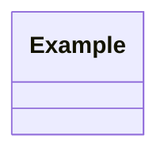

# Environment Manager

이 저장소의 목표는 Woonyong의 VS Code 중심 개발 환경을 다른 macOS 또는 Windows 환경에서 최대한 재현할 수 있게 보관하는 것입니다.

## Daily Sync

Codex 자동화 `개발환경 설정 동기화`가 하루 1회 이상 실행되도록 등록되어 있습니다. 자동화는 로컬 개발 환경을 조사하고 의미 있는 변화가 있으면 저장소 문서와 설정 스냅샷을 갱신한 뒤 커밋하고 푸시합니다.

자동화가 확인하는 범위:

- VS Code User `settings.json`, `keybindings.json`, `tasks.json`, snippets
- `woonyong` VS Code profile 설정, tasks, snippets, profile extensions
- 설치된 VS Code extensions와 버전 스냅샷
- formatter, linter, clang-format, Python, C/C++, JS/TS 관련 컨벤션
- Homebrew, Node.js/npm, Python, Git, Docker 등 개발 도구 상태 중 재현에 필요한 항목
- `snapshots/` 아래의 도구 버전과 패키지 매니저 상태
- macOS와 Windows에서 따라 할 수 있는 설치/복원 가이드

## Reproducibility Levels

### Level 1: Team Default

팀원이 가장 쉽게 따라 할 수 있는 기본 복원입니다.

- macOS/Linux: `bash install.sh`
- Windows: `powershell -ExecutionPolicy Bypass -File .\install.ps1`

복원 대상:

- 글로벌 VS Code settings
- 글로벌 keybindings
- 글로벌 tasks
- 글로벌 snippets
- `extensions.txt`의 curated extension 목록
- JetBrains Mono 폰트 안내 또는 설치 시도

### Level 2: Profile Snapshot

`woonyong` 프로필까지 더 가깝게 맞추는 복원입니다. VS Code에서 `woonyong` 프로필을 먼저 생성하거나 선택한 뒤 실행합니다.

```bash
python3 scripts/apply_to_vscode.py
python3 scripts/install_extensions.py
```

복원 대상:

- `vscode-user/` 아래의 User 디렉토리 스냅샷
- `vscode-user/profiles/woonyong/` 아래의 프로필 스냅샷
- 버전이 포함된 extension snapshot

## Exclusions

아래 항목은 의도적으로 커밋하지 않습니다.

- API keys, tokens, passwords, certificates, SSH private keys
- VS Code 또는 extension의 로그인 세션과 계정별 secret storage
- OS keychain, browser profile, cookies
- machine-specific caches, build artifacts, temporary files
- 개인 프로젝트의 민감한 workspace state
- 재현에 필요 없는 절대 경로와 개인 식별 정보

## Platform Notes

macOS 기준 설정에는 Apple Command Line Tools의 clang 경로가 포함되어 있습니다. Windows에서 C/C++를 사용할 때는 MSVC, LLVM, MinGW 중 팀 환경에 맞는 컴파일러를 별도로 설치하고 VS Code의 compiler path를 조정해야 합니다.

키바인딩 문서에서는 macOS의 `Cmd`를 기준으로 설명합니다. Windows에서는 대부분 `Ctrl`로 치환해서 사용합니다.

`scripts/export_from_vscode.py`와 `scripts/apply_to_vscode.py`는 macOS, Windows, Linux의 VS Code User 경로를 자동 감지합니다. Windows에서는 `%APPDATA%\Code\User`, macOS에서는 `~/Library/Application Support/Code/User`를 기준으로 동작합니다.

## Tooling Snapshots

개발 도구 상태는 아래 파일에 저장합니다.

- `snapshots/tool-versions.json`: VS Code, Homebrew, Node.js/npm, Python/pip, Git, Docker, GitHub CLI, 셸/버전 상태
- `snapshots/homebrew-formulae.txt`: 현재 macOS에 설치된 Homebrew formula 목록
- `snapshots/homebrew-casks.txt`: 현재 macOS에 설치된 Homebrew cask 목록
- `snapshots/npm-global-packages.txt`: 현재 전역 npm 패키지 이름과 버전

Windows에서는 Homebrew 스냅샷 대신 `tool-versions.json`을 기준으로 필요한 런타임을 설치합니다. 패키지 매니저는 팀 표준에 맞춰 `winget`, `choco`, `scoop` 중 하나를 선택하되, 이 저장소 문서에는 재현에 필요한 도구 이름과 버전만 남기고 사용자별 설치 경로는 남기지 않습니다.

## Markdown UML and Mermaid Preview

Markdown UML 문서는 이미지 파일이 아니라 보통 fenced block 형식으로 관리합니다.

````markdown

````

에디터별 기준:

| Editor | Expected support | Notes |
|---|---|---|
| VS Code | Supported | `bierner.markdown-mermaid`가 설치되어 있어야 Markdown Preview에서 Mermaid fenced block을 렌더링합니다. 현재 스냅샷은 `bierner.markdown-mermaid@1.32.1`을 포함합니다. |
| Cursor | Needs separate verification | Cursor는 VS Code 계열이지만 확장 설치 경로와 CLI가 별도일 수 있습니다. 이 머신에서는 `cursor` CLI가 PATH에 없고 `code` CLI만 확인됩니다. |
| Other Markdown editors | Varies | 에디터가 Mermaid를 내장 지원하지 않으면 diagram block이 코드로만 보일 수 있습니다. |

프로젝트의 `.vscode/extensions.json`은 추천 목록입니다. VS Code나 Cursor가 파일을 보고 추천 알림을 띄울 수는 있지만, 확장을 자동 설치하지 않습니다. 팀원은 Extensions 패널에서 추천 확장을 설치하거나 아래 명령을 직접 실행해야 합니다.

```bash
code --install-extension bierner.markdown-mermaid
```

Cursor를 사용하는 경우 먼저 CLI가 있는지 확인합니다.

```bash
command -v cursor
cursor --list-extensions
cursor --install-extension bierner.markdown-mermaid
```

macOS에서 Cursor 앱은 있지만 CLI가 없다면 Cursor에서 Shell Command 설치 메뉴를 찾아 `cursor` 명령을 PATH에 추가합니다. 그래도 CLI가 없으면 Cursor의 Extensions UI에서 `Markdown Mermaid`를 설치합니다.

Mermaid preview가 계속 보이지 않으면 SVG로 렌더링해서 Markdown에 이미지 링크를 거는 fallback을 사용합니다.

```bash
npx -y @mermaid-js/mermaid-cli -i diagram.mmd -o diagram.svg
```

Markdown 문서에는 아래처럼 연결합니다.

```markdown

```

여러 Mermaid block이 한 Markdown 파일에 들어 있다면 block을 각각 `.mmd` 파일로 분리한 뒤 SVG로 export합니다. 문법 확인 목적이라면 Mermaid CLI 렌더링 성공 여부를 기준으로 보고, VS Code/Cursor 미리보기만 실패하는 경우는 에디터 preview 환경 문제로 분류합니다.

## Maintenance Rules

- 현재 로컬 환경이 기준이지만, 팀원이 재현하기 어려운 개인 취향이나 임시 설정은 문서화 후 선별합니다.
- 설정 변경은 가능하면 `settings.json`, `keybindings.json`, `extensions.txt`, `vscode-user/` 스냅샷에 함께 반영합니다.
- 도구 상태 변경은 가능하면 `scripts/export_environment_snapshot.py`를 실행해 `snapshots/`까지 함께 반영합니다.
- 문서에는 macOS와 Windows 경로를 같이 남깁니다.
- 커밋 메시지는 `commit-convention` 스킬의 한국어 Conventional Commit 형식을 따릅니다.
- 의미 있는 변경이 없으면 커밋하지 않습니다.
